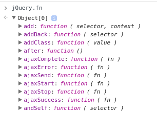

# (Creating) jQuery Plugins

A plugin in jQuery basically means extending the jQuery prototype to include a new function that will be able to convert your element in some shape or form as outlined by your plugin. The jQuery prototype is referred to by the `fn` property (`jQuery.fn`).

In your browser console, if you type in jQuery.fn you will be able to see the large list of available functions on the prototype. As per the following short portion of the output:



So, we just need to extend this object to include a function that will support our desired functionality (plugin). If for example we wanted a simple plugin to change to RTL, we could add an `rtl` function to the jQuery prototype like so:

```js
jQuery.fn.rtl = function(){
    console.log('todo: make element style emcompass RTL');
}
```

Then, as you'd be used to, you just select your element in jQuery, then apply it by calling the `rtl` function.

```js
$('#textIn').rtl();
```

See: http://codepen.io/tschf/pen/wzKjkK

Now that we have the basic concept it place, we need to actually make some changes to the element in order for the plugin to behave as expected. Inside our function, `this` refers to the jQuery selected element, so available jQuery APIs can be applied to `this`. Since modern day CSS comes with a `direction` property, we want to use the CSS API to add a new rule of `direction: RTL`. Since chaining is a common feature when calling jQuery APIs to run different actions in a sequence, it's also a good day to return `this` at the end of implementation.

```js
jQuery.fn.rtl = function(){
  this.css('direction', 'RTL');
  return this;  
}
```

See: http://codepen.io/tschf/pen/yaYEBX

If you use different naming in your environment for the jQuery libraries, to avoid conflicts, this can be wrapped in an anonymous function so that you can pass in the jQuery object. The examples above use the name `jQuery` but it is common to use `$` - so you can update your code to use `$` and pass in `jQuery` to the anonymous function. This way, if you do use another naming for the jQuery library, the plugin initialisation can easily be updated by changing what's passed into the anonymous function.

```js
(function($){
  $.fn.rtl = function(){
    this.css('direction', 'RTL');
    return this;  
  }
})(jQuery);
```

See: http://codepen.io/tschf/pen/XjmYWE

For more advanced plugins, accepting options wouldn't be all to uncommon. It wouldn't be unreasonable to define some defaults in your plugin and this is where jQuery's [extend](https://api.jquery.com/jquery.extend/) API can come in handy. With this API, you have a base object (param 1) and build an object comprising of properties in any additional objects you pass in. The last properties further downn the list of objects take precenednce. e.g. if I pass in 3 objects with the property `foo`, only the last `foo` value will be used from the parameter list.

```js
(function($){
  $.fn.cssMagic = function(options){
    var baseRules = {
      'color':'black',
      'background-color': 'white'
    };

    var applyRules = $.extend(
      baseRules,
      options
    );

    this.css(applyRules);
    return this;  
  }
})(jQuery);
```

See: http://codepen.io/tschf/pen/EgVRVp

A common design pattern you can use to enhance the previous example is to define a property beneath your plugin name definition so that sites using your plugin can specify a default once without needed to pass in the new value each and every time. And this method, the defaults become modifiable, whereas the previous example had them locked in

```js

(function($){
  $.fn.cssMagic = function(options){

    var applyRules = $.extend(
      $.fn.cssMagic.defaults,
      options
    );

    this.css(applyRules);
    return this;  
  }

  $.fn.cssMagic.defaults = {
    'color' : 'black',
    'background-color' : 'white'
  };
})(jQuery);
```

See: http://codepen.io/tschf/pen/WGQyGp

This API is good to set up a basic plugin, but as you wish to add more features it can become a bit limiting. That's where we enter jQuery widget factory. You can expose a set of functions for your plugin. Widget factory is provided as part of jQuery UI. To create a widget, you use the [widget](https://api.jqueryui.com/jquery.widget) API, where the first argument is the namespace of the plugin, where the last part of the namespace becomes the plugin name - this should only contain one period (`.`). Such as `tschf.rtl`. An optional second parameter is the widget to inherit from which by default would be `jQuery.widget`. The third and final parameter is the implemntation of the plugin which is an object with all the required functions to get the desired result. At a minimum, you would want to provide the `_create` to apply the functionality to the selected element.

Unlike the basic plugin API described earlier, the `this` value is an object with two key properties - `element` and `options`. Unlike the basic plugin where the create functions `this` option is a collection of all elements matching, the widget factory will have a different instance for each matching element, with `this.element` having one element per instance. When you pass in an object to apply the plugin to an element, those properties become available in `this.options`.

See: http://codepen.io/tschf/pen/mAZjEw

What's good by using widget factory is that you can add an API to your plugin. Any functions you create in the creation object will by private if they are prefixed with an underscore (e.g. _privateMethod). Any other functions will be made available publicly. So, if we add a method named `revert`, we can apply that with `$('#textInput').rtl("revert");`.

See: http://codepen.io/tschf/pen/XjmBrA
